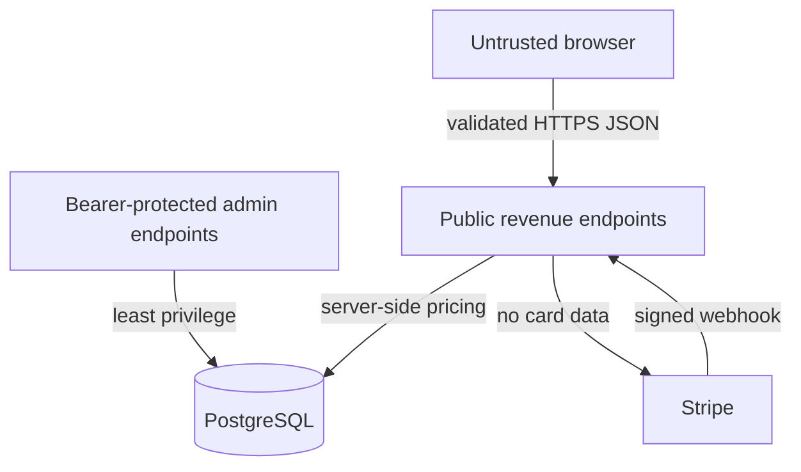

# ClearGlass Live Revenue Command System

> **Superseded roadmap.** The Phase 1 design package is in [`docs/crcs/`](crcs/README.md). It keeps the revenue definitions below and replaces the launch gate and seven-day loop.

## Purpose

CRCS is an additive commercial operating layer for the existing ClearGlass commerce control plane. It preserves the current site, pricebook, payment adapters, order ledger, governance gate, fulfillment logic, and existing content.

First entry offer: **Rapid Website & Deployment Diagnostic — CAD $125 placeholder**.

The price remains configurable in the existing server-side pricebook. Live purchase activation is separately gated by CRCS_RAPID_DIAGNOSTIC_ENABLED=false until the owner confirms price, refund policy, delivery promise, payment route, and support route.

## Architecture

```mermaid
flowchart LR
  V[Visitor] --> P[revenue-command.html]
  P -->|qualification| API[/revenue/leads]
  P -->|checkout| PAY[/revenue/checkout]
  PAY --> STRIPE[Stripe Hosted Checkout / Payment Link]
  STRIPE --> WH[/webhooks/stripe]
  WH --> LEDGER[(Orders + Events)]
  LEDGER --> PROV[Service Order Provisioning]
  API --> CRM[(Leads + Activities)]
  CRM --> COCKPIT[/revenue/cockpit]
  LEDGER --> COCKPIT
  PROV --> DELIVERY[Delivery Queue]
  DELIVERY --> FOLLOW[Follow-up / expansion]
```

## Trust boundaries



The browser never supplies price, Stripe Price ID, arbitrary redirect URL, card data, or admin authorization.

### Phase 0 contract (2026-09-24)

- `POST /revenue/leads` answers **201** with `{status, reference, next_step, booking_url}`. The
  reference is an opaque UUID; the lead id, stage, score and owner stay internal. A honeypot
  hit gets the same answer and stores nothing.
- `POST /revenue/checkout` takes `{customer_email, reference}`. `lead_id` is no longer accepted.
- The owner cockpit is the admin app's `/revenue` page, rendered server-side. The public
  page no longer has a cockpit or an admin-key field.
- `GET /events` and `GET /metrics/*` require the admin credential.

## Commercial model

| Offer | Purpose | Payment |
|---|---|---|
| Rapid Website & Deployment Diagnostic | Fixed-scope triage of website, deployment, performance, or conversion-path problems | CAD $125 placeholder; hosted Stripe payment or server checkout when owner-enabled |
| ClearGlass AI & Security Revenue Systems Audit | Broader conversion, workflow, resilience, and implementation-priority diagnostic | Owner-configured / proposal path |
| Rapid Implementation Sprint | Delivery of approved findings | Proposal / scoped checkout |
| Managed Optimization & Technical Advisory | Ongoing support | Recurring contract |

## Revenue definitions

- **Confirmed Revenue:** live-environment, verified payment records (Stripe or PayPal) less settled refunds, money held in open disputes, and money lost to disputes (`order_ledger.revenue_breakdown`). The cockpit also reports gross, refunded, disputed and lost amounts separately.
- **Test Revenue:** sandbox/test evidence, never commercial revenue.
- **Pipeline:** owner-entered expected value on open opportunities.
- **MRR (verified):** active and trialing Stripe subscriptions, as written by the signature-verified subscription webhook, priced from the price-book Stripe Price they are on (annual ÷ 12). Subscriptions on unknown Prices, including every test-mode Price, are excluded and counted separately.
- **Contracted MRR:** owner-entered monthly recurring value on won and active leads. A contract figure, not Stripe data.
- **Revenue by processor:** the same confirmed-revenue rule split by Stripe, PayPal and other sources (`revenue_by_provider`). The rows sum to confirmed revenue; a double payment for one order shows in both rows and is flagged, not hidden.
- **ClearGlass order:** `CG-ORD-YYYY-XXXXXXXX`, one offer payable by either processor. `payment_verified` is true only after a signed processor webhook (`docs/GROWTH_REVENUE_OS.md`).
- **Revenue by campaign:** confirmed revenue grouped by the `utm_campaign` carried from the lead or checkout request through Stripe metadata onto the order. Payment Links carry none, so their sales are `unattributed`.
- **Close Rate:** WON divided by WON plus LOST.
- **Gross Margin:** confirmed live revenue less recorded delivery costs. The cockpit returns no margin figure when cost evidence is absent.

## Launch gate

Before enabling live payments, the owner must confirm the exact offer, price, refund language, delivery capacity, payment route, support route, admin credential, actual public domain/API base, and calendar configuration. No production payment link or credential is generated by this code change.

## First seven-day commercial loop

Day 1: approve offer contract, verify checkout and intake.
Day 2: prepare a matched prospect list; no outbound send is automatic.
Day 3: review inbound demand and book conversations.
Day 4: perform the first diagnostic delivery.
Day 5: obtain approval for any implementation proposal.
Day 6: reconcile payments, delivery evidence, and follow-up dates.
Day 7: review confirmed revenue, conversion friction, retention, and expansion opportunities.

## Governance

Human approval remains required before outbound communications, proposals, contracts, refunds, live pricing changes, public publishing, permission changes, security-posture changes, production deployment, and money movement. The CRCS checkout only starts a customer-initiated purchase for an owner-enabled, server-priced offer.

## Operations

GET /revenue/health is safe for uptime and synthetic monitoring. It reports database state, payment-route configuration, latest Stripe evidence timestamp, booking configuration, and internal CRM readiness without exposing customer records or secrets.

Rollback is additive: disable the first-offer flag and revert application code if needed. Do not delete financial or customer records during rollback.
