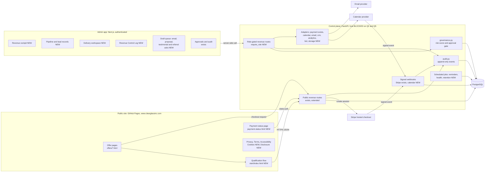
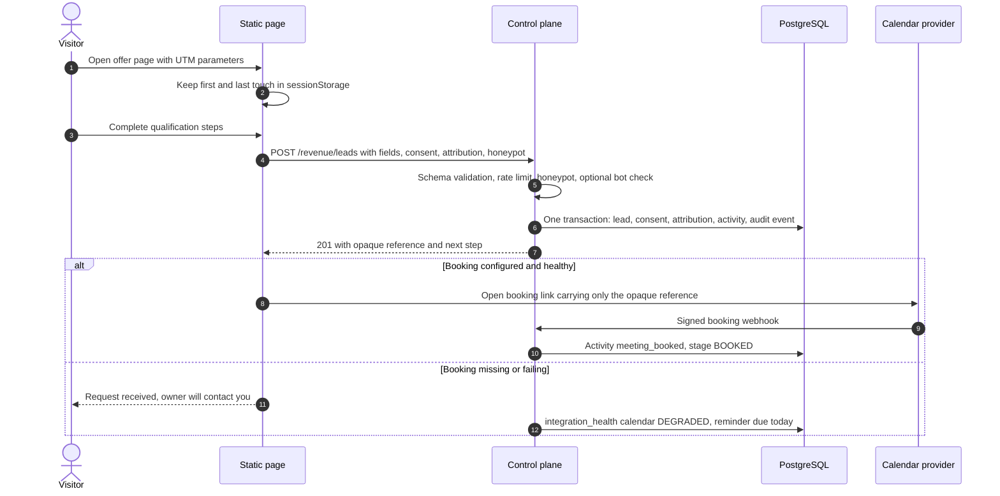
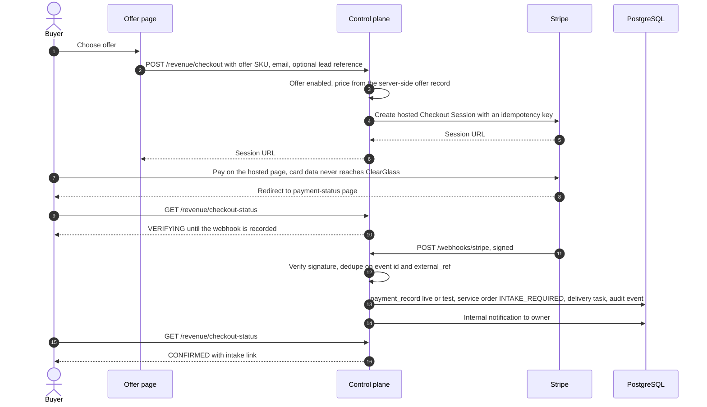
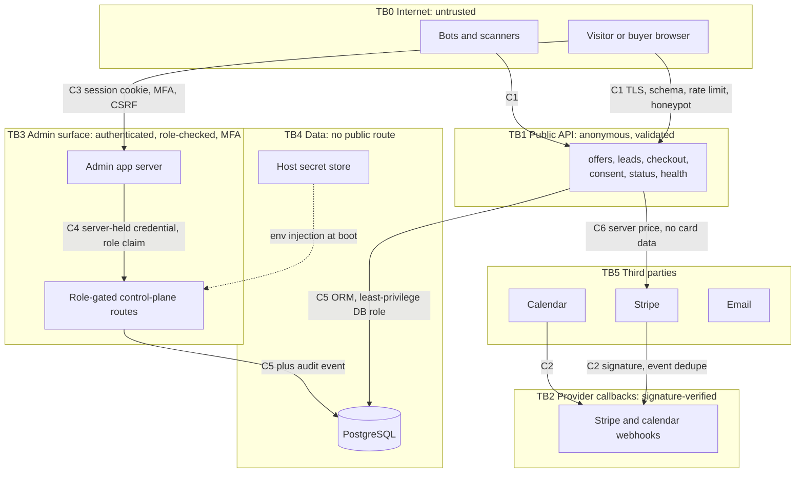

# CRCS — Production architecture

Target state for Phase 1. Every component below either **exists** in this repository
or is marked **NEW**. The decision to build on the existing control plane rather than a
new stack is recorded in
[ADR 0002](../../adr/0002-crcs-extend-existing-control-plane.md).

No deployment of any of this was found (see [README §1](README.md#1-verified-state-read-before-anything-else), S2).

---

## 1. Components

**Text alternative.** Visitors use static pages on GitHub Pages. Those pages call a small
set of anonymous, validated control-plane routes to read offers, submit a qualification,
start a hosted Stripe checkout, and poll payment status. Stripe and the calendar provider
call back through signature-verified webhooks. The owner works only in the authenticated
admin app, which calls role-gated control-plane routes from its server; the browser never
holds a control-plane credential. Every write passes through the governance gate where it
is consequential, and every material change lands in the append-only `events` ledger in
PostgreSQL.

| Component | Path | State | Revenue outcome it serves |
|---|---|---|---|
| Static offer and legal pages | `*.html`, `offers/`, `legal/` | exists; 6 pages NEW | Buyer understands one offer and one next step |
| Qualification flow | `start/index.html` | NEW, replaces the form in `revenue-command.html` | Qualified lead with attribution |
| Public revenue routes | `control-plane/app/routers/revenue.py` | exists; extended | Lead capture, checkout start |
| Stripe checkout and webhook | `control-plane/app/payments.py`, `routers/payments.py` | exists, tested | Verified payment |
| Governance gate | `control-plane/app/governance.py` | exists, tested | No consequential action without approval |
| Audit ledger | `control-plane/app/audit.py`, `events` table | exists | Evidence for every revenue number |
| Role-gated admin routes | `control-plane/app/rbac.py` | NEW | Least-privilege access to lead data |
| Adapters | `control-plane/app/adapters/` | NEW (payment wraps existing code) | Swappable providers, health reporting |
| Admin app pages | `admin/app/revenue/` | NEW | Owner acts on due commercial actions daily |

---

## 2. Data flows

### Flow A — visitor to qualified lead to booked call

The lead is committed **before** any handoff, so a calendar outage cannot lose it.

### Flow B — buyer to verified payment to delivery queue

The success URL never marks anything paid. Only a signed webhook does (`routers/payments.py:172-251`
already enforces this and only provisions a service order from a **verified, live** event).

### Flow C — delivery to referral draft

`delivery confirmed by customer or owner` → `service_orders.delivery_confirmed_at` →
`testimonial_request` and `referral_request` rows created with status `DRAFT` →
owner approves in the draft queue → send via email adapter → `sent_at` + audit event.
Nothing is sent automatically.

---

## 3. Trust boundaries

| Control | Boundary | Exists today | Gap closed in |
|---|---|---|---|
| C1 schema, per-IP limit, honeypot | TB0→TB1 | Yes (`schemas.py`, `security.py`) | Turnstile only if spam is observed (Phase 2, evidence-gated) |
| C2 webhook signature + dedupe | TB5→TB2 | Stripe yes; calendar no | Phase 1 |
| C3 admin session | TB0→TB3 | Shared token, no MFA, open redirect (S8) | Phase 0 (redirect, lockout), Phase 1 (per-user, TOTP) |
| C4 server-held credential | TB3 | No: key typed into public page (S7) | Phase 0 |
| C5 DB access | TB1/TB3→TB4 | ORM yes; one DB role for everything | Phase 1: separate migration role and app role |
| C6 server-side price | TB1→TB5 | Yes (`pricebook.py`, `test_pricebook.py`) | — |
| C7 response headers on public pages | TB0 | Declared in `_headers`, **not served** by GitHub Pages; the API sets its own (`main.py` `security_headers`) | Phase 1 meta CSP on CRCS pages; `frame-ancestors`/HSTS need an owner-approved edge proxy |

---

## 4. Threat model summary

Method: STRIDE per boundary, against the assets in [DATA_MODEL.md](DATA_MODEL.md).
Verification baseline: OWASP ASVS 5.0.0, used as a checklist. **No ASVS level, compliance
status or certification is claimed.**

| # | Threat | Asset | STRIDE | Current control | Gap | Phase |
|---|---|---|---|---|---|---|
| T1 | Browser claims payment success | Revenue figures | Spoofing | Webhook-only provisioning, live/test split (in code) | The live-only provisioning branch has no test | 1 |
| T2 | Webhook replay or duplicate delivery | Payment records | Tampering | `orders.external_ref` unique (migration 004); event-id ledger `stripe_events` on the subscription webhook (migration 006) | CRCS checkout does not pass the idempotency key `payments.create_checkout_session` already accepts | 1 |
| T3 | Price tampering in request | Payments | Tampering | Server-side price book; schema has `{sku, quantity}` only | none | — |
| T4 | Lead-form spam and flooding | Pipeline quality, DB | DoS | Honeypot, 30/min/IP | Honeypot answers 400, which tells bots they were caught | 0 |
| T5 | Lead enumeration | Lead existence | Info disclosure | Checkout gives one answer for unknown and mismatched lead (`0761471`) | Form response returns sequential lead id | 0 |
| T6 | Admin key captured from public page | All lead PII | Info disclosure | none | Cockpit in public page (S7) | 0 |
| T7 | Admin credential brute force | Admin surface | Elevation | Burst logging only | No lockout; non-constant-time compare | 0 |
| T8 | Post-login redirect to attacker page | Admin credential | Spoofing | none | Open redirect (S8) | 0 |
| T9 | Over-broad access | Lead PII | Elevation | One shared key | No roles, no per-user identity | 1 |
| T10 | PII in logs or analytics | Lead PII | Info disclosure | Audit payload key redaction | No allow-list on analytics payloads | 1 |
| T11 | Bulk export exfiltration | Lead PII | Info disclosure | No export route exists | Export must be ADMIN-only and audited | 2 |
| T12 | Undisclosed processor | Consent validity | Repudiation | none | Form relay not in privacy notice (S6) | 0 (owner approval) |
| T13 | Persistent tracking beyond notice | Visitor privacy | Info disclosure | none | `localStorage` UTM (S12) | 0 |
| T14 | Audit rows altered | Evidence | Tampering | Insert-only by convention | No hash chain on `events` | 2 |
| T15 | Unscanned dependency or leaked secret | Whole system | Tampering | `ci_local.py`, `secret_scan.py` | Actions runners not dispatched (S9) | owner (F1) |
| T16 | Single instance down | Lead capture | DoS | none | No uptime check, no fallback copy | 1 |
| T17 | Unapproved outbound message | Reputation, consent | Repudiation | Governance gate for commerce actions | CRCS drafts not yet routed through it | 1 |
| T18 | Clickjacking, script injection on public pages | Visitor trust, form integrity | Tampering | `_headers` declares CSP, HSTS, `frame-ancestors`, Permissions-Policy | **GitHub Pages does not apply `_headers`** (`edge-security-assessment.md:13`), and no page carries a meta CSP. Meta CSP covers CRCS pages in Phase 1, but cannot set `frame-ancestors` or HSTS; those need an edge proxy the owner controls | 1 (meta CSP); owner (edge) |

---

## 5. Gap analysis: specification vs. CRCS v1

| Requirement | CRCS v1 today | Disposition |
|---|---|---|
| Offer ladder as configurable data | 1 offer in `pricebook.json`; scope/exclusions hard-coded in `revenue.py` | Phase 1: `offers` table, seeded from price book |
| Multi-step accessible form, error summary | Single-step form in `revenue-command.html`, no error summary | Phase 1: `start/index.html` |
| Server-side validation | Pydantic schemas | Keep; tighten enums |
| UTM first/last touch, referrer, landing page | Columns on `leads` | Keep; move to `attribution_records` in Phase 2 only if multi-touch is needed |
| Consent with withdrawal | Boolean `consent_marketing` | Phase 1: `lead_consent` table, signed unsubscribe link |
| Manual-review queue | Stage `REVIEW_REQUIRED` when score < 60 | Keep; score never rejects |
| Calendar adapter with fallback | Booking URL setting only | Phase 1 |
| Payment adapter, webhook, idempotency, test/live | Built for Stripe; PayPal separate | Phase 1: wrap behind interface, add idempotency key |
| CRM stages, owner, next action, timeline, audit | Present on `leads` + `lead_activities` | Keep |
| RBAC ADMIN/OPERATOR/VIEWER | One shared key | Phase 1 |
| Export with logging | None | Phase 2 |
| Cockpit with definitions | JSON endpoint; UI in public page | Phase 0 remove, Phase 1 admin app |
| Close-rate denominator selectable | Fixed WON/(WON+LOST) | Phase 1: denominator parameter, default unchanged |
| MRR from contracted recurring only | Owner-entered lead field | Phase 1: from active `subscriptions` + recorded contracts; lead field becomes pipeline |
| Revenue Control Log | Table + create/list routes | Keep; add update route and today warning in UI |
| Delivery workspace | `service_orders` | Phase 1: `delivery_tasks`, tokenized intake link |
| Testimonials/referrals | Flag `testimonial_eligible` | Phase 2 |
| Content CMS | None for CRCS; blog is static | Phase 2 |
| Analytics event layer | None | Phase 1: first-party table, allow-listed |
| Integration health | Table exists, never written | Phase 1 |
| Threat model, ADR, runbooks | This package; `docs/INCIDENT_RESPONSE.md`, `docs/RUNBOOK.md` exist | Phase 1: CRCS-specific sections |
| CI gates | `ci_local.py` runs offline; Actions dead (S9) | Keep `ci_local.py` authoritative until F1 cleared |

---

## 6. Deployment topology (target, BLOCKED on Q2 and Q5)

| Surface | Host | Deploy path | Rollback |
|---|---|---|---|
| Public pages | GitHub Pages, branch deploy | Merge to `main` (the only working deploy path — `CLAUDE.md`) | Revert commit |
| Control plane | Render web service per `render.yaml` (not yet created) | Owner approves service creation; migrations run as a pre-deploy step | Previous image; migrations are additive |
| Database | Render Postgres (not yet created) | Owner approves; daily backups | Point-in-time restore per provider plan |
| Admin app | Render web service per `render.yaml` | Owner approves | Previous image |

`AUTO_CREATE_TABLES` must be `false` in production once numbered migrations are the
schema source; `render.yaml` currently sets it `true` and says so in a comment.
