# Sentinel AI — Architecture Evolution and Vision 2035

> **Status: target architecture, grounded in the repository as of 2026-09-29.**
> Section 1 describes what exists, with file paths; everything else is a
> design. Every component below carries one of three marks:
>
> | Mark | Meaning |
> |---|---|
> | ✅ | Exists in this repository and is tested |
> | ◐ | Evolves existing code; the starting point is named |
> | ◻ | New; not provisioned anywhere today |
>
> Nothing marked ◐ or ◻ is running. Sentinel's public console holds no
> credentials, reaches no system and monitors nothing, and this document does
> not change that. Companion documents: the v2030 charter
> (`SENTINEL_CORE_2030_SPEC.md`), the v8 control-plane spec
> (`PERCIVAL_V8_SPEC.md`) and the v9 deployment blueprint
> (`PERCIVAL_V9_DEPLOYMENT.md`).

**Contents:** [Executive overview](#executive-overview) ·
[1 Current state](#1-current-state-assessment) · [2 Gaps](#2-architecture-gaps) ·
[3 Architecture](#3-proposed-architecture-sentinel-mesh) ·
[4 Components](#4-component-specifications) · [5 Security](#5-security-model) ·
[6 Governance](#6-governance-model) · [7 Agents](#7-agent-ecosystem) ·
[8 Stack](#8-technology-stack) · [9 Roadmap](#9-implementation-roadmap) ·
[10 Risks](#10-risk-analysis) · [11 Advantage](#11-competitive-advantage-and-innovation) ·
[12 Diagram index](#12-diagram-index) · [13 Vision 2035](#13-sentinel-ai-vision-2035)

---

## Executive overview

**Sentinel already owns the hard part that most agent platforms bolt on
last: a fail-closed governance substrate.** A deny-by-default governor,
four capability tiers, signed single-use approvals, hash-chained audit, a
privacy charter enforced in code, and a self-healing loop that only closes
an incident after an independent probe verifies it. These are real, tested,
stdlib-only modules.

**What it lacks is a runtime and a single spine.** Nothing runs
continuously: 84 workflows (37 on a schedule) have had no runner since
2026-09-06, so the agents are libraries waiting to be called. Governance is
split across seven risk and policy engines whose tables have already drifted
(the control plane scores 52 actions, `agent_os` scores 29). Evidence is
split across five audit ledgers, only some of them hash-chained. There is
one model integration (`POST /sentinel/ask`), and it is off by default.

**The evolution is therefore ordered, not additive:**

1. **Unify the kernel.** One policy source compiled to every enforcement
   point, one decision record, one anchored ledger.
2. **Give agents a runtime.** Durable workflows, agent identities and a
   registry, all under the kernel.
3. **Add cognition.** Tiered memory, a bitemporal knowledge graph and a
   research engine with provenance.
4. **Add foresight.** Digital twins that every consequential action must pass
   through, and calibrated prediction whose track record earns agents their
   autonomy.

Each stage is useful on its own, and none widens what an agent may do
without a human-approved envelope.

**The strategic bet:** by 2030 autonomous agents will be commodity, and the
scarce thing will be *provable* governance: evidence that an automated
decision was authorized, grounded, simulated and reversible. Sentinel's
design makes that evidence the product.

---

## 1. Current-state assessment

### 1.1 Inventory

| Layer | Component | Where | State |
|---|---|---|---|
| Experience | Sentinel Core console: Ask, Intel Desk, Site Intelligence, Mission Control, Intelligence Graph, four writing modes, per-tab hash-chained ledger | `station-chat.js` (4,151 lines) | ✅ live on 167 public pages (GitHub Pages) |
| Experience | Sentinel conversation: 13 rule-guided pathways (6 missions), project-brief intake, voice dictation | `sentinel.js`, `index.html` | ✅ live, home page |
| Experience | Command surfaces: geospatial map, cyber console, OSINT deck, dashboards | `sentinel.html`, `cyber-defense-console.html`, … | ✅ static demonstrations, no live feeds |
| API | Governed commerce control plane: risk scoring, two-phase approvals, append-only `events` ledger, per-IP throttles, route-auth coverage gate | `control-plane/` (FastAPI, Postgres) | ✅ deployable (Render blueprint); 710 tests |
| API | Claude-backed answers: four read-only site tools, daily cap, keyed-hash ledger rows | `control-plane/app/sentinel_ai.py` | ✅ built, **off by default** |
| Governance | Commerce risk table (52 actions, 24 always-escalate) | `control-plane/app/governance.py` | ✅ |
| Governance | Agent-OS risk table (29 actions, 17 always-escalate) | `agent_os/governance.py` | ✅ (drifted from the above) |
| Governance | SABER assurance gate: permit iff C ≥ τ ∧ R_data ⊆ P_user ∧ S_threat < ε | `sentinel/sentinel/governance.py` | ✅ |
| Governance | Sovereign policy governor: deny-all, capability schema | `sentinel/sentinel/governor.py`, `schemas/capabilities.json` | ✅ |
| Governance | Privacy charter v2.1 gate (no person identification) | `sentinel/sentinel/policy.py`, `SENTINEL_CHARTER.md` | ✅ |
| Governance | Agent-army routing and approval gates | `agent_army/orchestrator.py` | ✅ deterministic planner |
| Governance | RFED risk tables, mirrored in n8n with a parity test | `bots/rfed_audit_bot.py`, `deployment/rfed/` | ✅ |
| Authority | Scoped agent identity, four capability tiers (READ_ONLY → DRAFT → CHANGE → DEPLOY), HMAC-signed single-use expiring approvals | `identity.py`, `capability.py`, `approvals.py` | ✅ |
| Memory | Mission memory: JSON store with provenance, `stated` vs `inferred` confidence | `sentinel/sentinel/mission_memory.py` | ✅ single-operator |
| Memory | Ranked recall | `agent_os/memory.py` | ✅ in-process |
| Retrieval | Tenant-partitioned vector store (in-memory hashing embedding; Pinecone/Milvus adapters), Postgres RBAC recheck, adversarial-input scorer (regex) | `vectorstore.py`, `adapters.py`, `rbac.py`, `schema.sql`, `retrieval.py`, `redteam.py` | ✅ reference; adapters unprovisioned |
| Knowledge | Site graph (167 pages, 12 clusters, 861 links) | `data/site-index.json` ← `tools/internal_links.py` | ✅ generated |
| Knowledge | Organization-only entity graph (person node types rejected) | `sentinel/sentinel/graph.py` | ✅ in-memory |
| Agents | Named OSINT agent mesh, approved-source collector | `agentmesh.py`, `collector.py` | ✅ |
| Agents | PERCIVAL web-estate operations (safe-list auto-fix, else escalate) | `percival.py` | ✅ |
| Agents | PHOENIX self-healing: detect → contain → gate → execute → verify → learn, circuit breaker | `phoenix.py`, `selfheal.py` | ✅ simulated probes |
| Agents | Purple-team scoring, AEGIS legal-process shield, PFAS compliance, presence-only vision | `purpleteam.py`, `legalshield.py`, `pfas*.py`, `vision.py` | ✅ |
| Agents | 13-agent roster: planning DAG, contradiction-detecting intelligence, learning, recovery, state machine | `agent_os/` (1,944 lines) | ✅ library |
| Agents | 32 agent definitions (`agent.json` + system prompts) | `agents/` | ✅ configuration |
| Audit | Hash-chained ledgers ×3, append-only table ×1, per-tab browser chain ×1 | `sentinel/audit.py`, `agent_os/audit.py`, RFED, `events` table, console | ✅ five separate ledgers |
| Security | age/X25519 artifact encryption sidecar (Rust) | `agent_army/secure_runtime/` | ✅ |
| Automation | 84 workflows, 37 scheduled; 37 bot scripts | `.github/workflows/`, `bots/` | ⚠ dormant: Actions dispatches no runners (org entitlement) |

### 1.2 Strengths to preserve

These are rarer than they look, and every change below is designed around keeping them:

1. **Fail closed, everywhere.** An unverifiable variable denies (SABER gate,
   governor, charter gate, PHOENIX). Most agent frameworks fail open.
2. **Capability tiers with signed, single-use, bound approvals.** An approval
   for "publish copy" cannot be replayed as "move money".
3. **Privacy as a type-system rule.** `graph.py` rejects person nodes, and
   `policy.py` denies re-identification before any feed is touched.
4. **Verify-then-close autonomy.** PHOENIX treats a fix that "ran" but did not
   restore health as a failure.
5. **Honesty enforced by test.** The console's readouts cannot claim
   telemetry it lacks (`tests/test_sentinel_core.py`).
6. **Deterministic, stdlib-only cores.** Policy logic runs in minimal CI and
   replays identically.

---

## 2. Architecture gaps

### 2.1 Gap analysis

| # | Gap | Evidence | Consequence | Severity |
|---|---|---|---|---|
| G1 | **Governance fragmentation**: seven risk and policy engines | Control plane 52 vs `agent_os` 29 scored actions; RFED tables mirrored by hand into n8n | The same action can be low risk in one engine and unknown in another; every new action is a multi-file edit held together by tests | Critical |
| G2 | **Ledger fragmentation**: five ledgers, not all chained, no common anchor | `events` is append-only by trigger but not hash-chained; the others chain independently | No single proof of "everything Sentinel did on a date"; cross-system forensics is manual | High |
| G3 | **No runtime** | Agents are libraries and CLIs invoked by workflows; workflows have had no runner since 2026-09-06 | The platform's autonomy is dormant; self-healing, monitoring and reporting do not happen | Critical |
| G4 | **Thin model layer** | One LLM integration, off by default; retrieval uses a hashing embedding; injection detection is nine regexes | No semantic retrieval in production; adversarial defence is easily bypassed | High |
| G5 | **Memory is single-tier** | `mission_memory.py` is one JSON file; `agent_os` memory is in-process | No episodic history, no shared semantic memory, no retention or forgetting policy | High |
| G6 | **Static knowledge** | Site graph regenerated at commit time; entity graph in memory | No events, no time dimension, no provenance per fact, no propagation | High |
| G7 | **No evaluation harness** | Self-checks are rule-based; no regression suite scores model answers | Model or prompt changes ship blind; "self-improvement" cannot be measured | High |
| G8 | **No observability** | No traces or metrics; PHOENIX probes are injected fakes | Cannot operate, bill or debug agents in production | High |
| G9 | **In-process identity** | `AgentIdentity` objects, bearer admin keys | No workload identity, no mTLS, and no per-agent revocation across services | Medium |
| G10 | **Narrow modality** | Text PDFs, GeoJSON, presence events | No document intelligence at scale, audio, imagery or streams | Medium |
| G11 | **Supply chain gates dormant** | Security workflows exist but cannot run | Unsigned artifacts, unenforced dependency policy | High |
| G12 | **No crypto agility** | HMAC-SHA-256, SHA-256, X25519 hard-coded | Long-lived evidence has no post-quantum migration path | Medium |
| G13 | **Monolithic front end** | 4,151-line single script, no build or UI test runner beyond Node probes | Hard to extend safely; one syntax error kills the console | Medium |
| G14 | **No merge safety net** | With no runner, nothing checks a merge: on 2026-09-29 `main` carries 21 failing root tests and 45 ruff errors, and a 2026-09-25 conflict resolution dropped the console's answer card, so every site answer threw on the live site until it was restored with this document | Regressions reach production silently; `scripts/ci_local.py` only helps when someone runs it | Critical |

### 2.2 Bottlenecks

- **Human approval throughput.** Every escalation is one click by one person.
  At agent scale this becomes the bottleneck, and fatigue turns review into
  rubber-stamping.
- **Commit-time knowledge.** The site graph only changes when a generator
  runs in CI, which cannot run.
- **One database for everything.** Commerce, ledger and (future) memory
  compete in one Postgres instance.
- **CI as the only scheduler.** When Actions stops, all automation stops.

### 2.3 Outdated approaches

| Today | Why it is dated | Replacement |
|---|---|---|
| Keyword pathways (`sentinel.js`), regex intent parsing | Brittle; fails on paraphrase | Model routing with the rules as a verified fast path (◐, begun with `/sentinel/ask`) |
| Regex prompt-injection scoring | Trivially evaded | Layered defence: classifier, untrusted-data channel, egress control (§5) |
| Policy tables copied between Python and n8n with a parity test | Drift is caught, not prevented | One source compiled to every target (§6) |
| Scheduled CI jobs as agent runtime | No durability, retries or state | Durable workflow engine (§4.2) |
| Per-module audit logs | No global ordering or proof | Unified RFED record plus Merkle anchoring (§6) |

### 2.4 Missing capabilities versus the state of the art

| Capability | State of the art (2026) | Sentinel today | Target |
|---|---|---|---|
| Durable agent runtime | Workflow engines with retries, timers, human-in-the-loop signals | None running | §4.2 |
| Agent registry and discovery | Capability cards, agent-to-agent protocols, tool protocols (MCP) | Roster as data | §4.3 |
| Tiered memory | Working, episodic, semantic and procedural memory with retention | Single JSON store | §4.2 |
| Hybrid retrieval | Lexical + vector + graph retrieval with re-ranking and citations | Hashing embedding reference | §4.4 |
| Evaluations | Offline suites, online canaries, regression gates | Rule self-checks | §4.11 |
| Observability | OpenTelemetry traces across model and tool calls | None | §8 |
| Policy as code | OPA / Cedar decision points | Hand-written tables ×7 | §6 |
| Workload identity | SPIFFE identities, mTLS meshes | Bearer keys | §5 |
| Multimodal | Native image, document and audio understanding | Text only | §4.5 |
| Supply chain | Signed builds, SBOMs, provenance attestations | Dormant | §5 |

---

## 3. Proposed architecture: Sentinel Mesh

### 3.1 Design principles

1. **Kernel first.** Nothing gains autonomy before the governance kernel can
   see, score, simulate and record it.
2. **Everything an agent does is a proposal** until the kernel returns
   `permit`. Execution is a separate, credentialed step.
3. **One policy source, many enforcement points.** Rules are written once
   and compiled into the control plane, the agent runtime, n8n and the
   console.
4. **Evidence over assertion.** Every output carries its provenance, its
   confidence class (`stated`, `inferred` or `predicted`) and its decision
   record.
5. **Humans govern envelopes, agents operate inside them.** Standing,
   signed, budgeted approvals replace per-click approval for routine work.
6. **The privacy charter is a schema constraint.** Person-targeting is not
   refused at run time; it cannot be expressed.
7. **Degrade to rules, never to silence.** Every model-backed path has a
   deterministic fallback, as the console already does.

### 3.2 High-level system

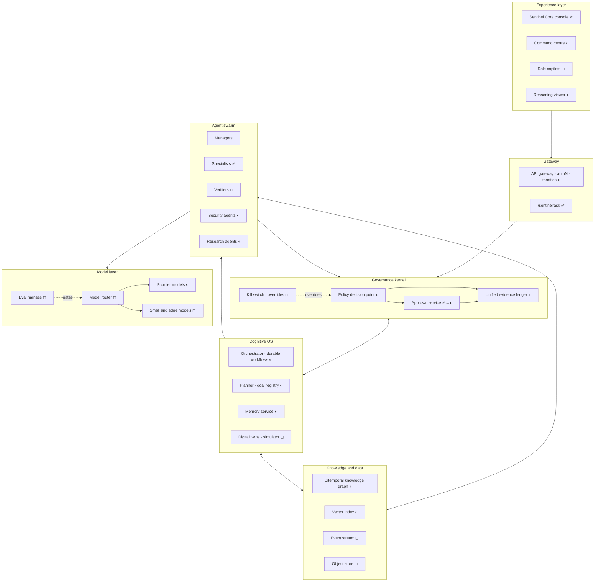

### 3.3 Components

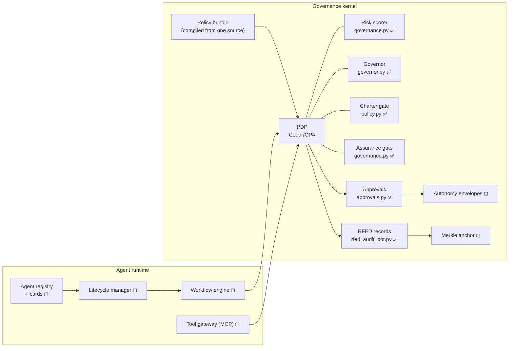

---

## 4. Component specifications

Each specification gives its purpose, what it builds on, its contract, and the
decisions that keep it governable.

### 4.1 Governance kernel ◐

- **Purpose:** the single policy decision point (PDP) for every agent action,
  tool call, data access and model call.
- **Builds on:** `control-plane/app/governance.py`, `agent_os/governance.py`,
  `sentinel/governor.py`, `sentinel/policy.py`, `sentinel/governance.py`,
  `agent_army/orchestrator.py`, and the RFED tables.
- **Contract:** `decide(principal, action, resource, context) →
  {permit | escalate | deny, tier, risk, reasons[], obligations[], record_id}`.
  Obligations are things the caller must do, for example "simulate first",
  "redact PII" or "log to tenant ledger".
- **Key decisions:**
  - One YAML source (`policy/actions.yaml`) holds every action's base risk,
    always-escalate flag, capability tier, charter category and simulation
    requirement. A generator emits the Python tables, the Cedar policy
    bundle and the n8n tables. The existing parity tests become generator
    freshness checks.
  - The SABER gate becomes a kernel rule for retrieval: permit iff
    confidence ≥ τ, data within the principal's permissions, and threat
    score < ε. It stays fail-closed on any unverifiable input.
  - Kernel changes are *never permitted* to agents (v2030 Phase 8) and need
    two human approvers.

### 4.2 Cognitive operating system ◐

| Sub-component | Purpose | Builds on | Design |
|---|---|---|---|
| Goal registry | Persistent goals, owners, deadlines, success metrics | `mission_memory.py` sections | Goals are versioned records; an agent may propose, only a human may commit |
| Planner | Objective → DAG of tasks with required capabilities | `agent_os/planning.py`, `agent_army/orchestrator.py` | Plans are deterministic artifacts; each node declares tier, budget and verification |
| Orchestrator | Durable execution: retries, timers, human signals, compensation | `agent_os/orchestrator.py` | A workflow engine (Temporal-class); every activity passes the PDP |
| Working memory | Per-task scratch context | none | Task-scoped, destroyed at completion; never written to long-term memory without a rule |
| Episodic memory | What happened: missions, decisions, outcomes | RFED records, `agent_os/learning.py` | Append-only event log keyed to RFED ids; retention by tenant policy |
| Semantic memory | What is true: facts with provenance | knowledge graph + vector index | Facts carry `stated`, `inferred` or `predicted` class and a validity interval |
| Procedural memory | How to do things: skills, playbooks | `agents/`, PHOENIX runbooks | Versioned skills; new skills arrive only as approved changes (§4.11) |
| Reflection loop | Lessons from outcomes | `agent_os/learning.py` | Lessons are proposals; one becomes procedure only after an eval shows improvement |

Context awareness comes from assembling the working set per task: goal +
relevant episodes + semantic facts within the principal's scope. That
assembly is itself a retrieval, so it passes the SABER rule.

### 4.3 Agent swarm framework ◐

- **Agent card** (◻), published to the registry:
  ```json
  {"id": "phoenix", "version": "3.2.0", "role": "specialist",
   "capabilities": [{"name": "restart_service", "tier": "CHANGE", "envelope": "env-phx-01"}],
   "inputs": ["incident"], "outputs": ["remediation_record"],
   "models": ["frontier", "small"], "budget": {"tokens_per_day": 2000000, "actions_per_day": 20},
   "trust": {"score": 0.94, "basis": "calibration ledger, 412 scored outcomes"},
   "autonomy_tier": "act-with-approval", "owner": "ops@clearglass", "retire_after_idle_days": 30}
  ```
- **Dynamic routing:** tasks match on capability; ties break on trust score,
  then cost, then latency. An agent without the capability at the needed
  tier is never considered. Discovery is the registry itself.
- **Spawning with capability attenuation:** a parent may spawn a child only
  with a subset of its own capabilities and budget, and the child expires
  with its task. Spawning can never escalate privilege; this is the
  object-capability rule `capability.py` already applies.
- **Retirement:** on expiry of its TTL, after idle time, when a newer
  version passes evals, or when its trust falls below a floor. Retired cards
  stay in the registry, read-only, for audit.
- **Consensus reasoning:** any output that will drive a CHANGE-tier action,
  or be presented as fact, needs a quorum of verifiers (default 2-of-3).
  Verifiers use at least two different models and see the claim and its
  evidence, not the producer's reasoning. Disagreement escalates with both
  positions attached.
- **Collaboration:** agents exchange typed messages through the orchestrator,
  never directly, so every hand-off is visible to the kernel.

### 4.4 Autonomous research engine ◐

Pipeline, each stage recorded:

1. **Source selection** from the approved registry (`collector.py`). Unknown
   sources are refused.
2. **Gathering**, with robots.txt, terms and rate limits enforced at the
   fetch boundary.
3. **Claim extraction** into atomic claims.
4. **Validation:** cross-source corroboration, with contradiction detection
   from `agent_os/intelligence.py`.
5. **Confidence** = source trust × corroboration × recency, calibrated
   against resolved outcomes.
6. **A provenance envelope per claim**, as in v2030 Phase 5: source,
   retrieved_at, validation_state, confidence, conflicting_sources and a
   hash-linked transformation chain.
7. **Report generation** with inline citations to envelopes, in the house
   style (`prompts/sentinel_core_system_prompt.md`).

**Truth reconciliation:** when two claims conflict and their confidence delta
is below 0.15, the report shows both and escalates. It never picks silently.

### 4.5 Multi-modal intelligence ◐

| Modality | Ingest | Understanding | Charter constraint |
|---|---|---|---|
| Text, documents | Parser service (extends `pfas_pdf.py` beyond text PDFs) | Frontier model with citations | Redact personal data before model calls |
| Voice, audio | Browser dictation ✅; server-side speech recognition ◻ | Transcript, then text pipeline | Consent recorded; no speaker identification |
| Images | Upload or feed | Vision-capable models | No face recognition or biometric templates (`vision.py`) |
| Video | Frame sampling at the edge | Presence and event analytics only ✅ | Counts *that* people are present, never *who* |
| GIS | GeoJSON, vector tiles ✅ | Spatial joins against the knowledge graph | Assets and facilities only |
| Sensors, IoT | MQTT or OPC UA at the edge → event stream | Anomaly and trend detection | Owned or authorized devices only |
| Satellite imagery | Licensed commercial providers | Asset-level change detection | No tracking of individuals; licence terms enforced |

All modalities normalize into the same claim and envelope model, so the
research engine, knowledge graph and twins stay modality-agnostic.

### 4.6 Advanced knowledge graph ◐

- **Bitemporal model:** every node and edge has valid time (when it was true)
  and transaction time (when Sentinel learned it). This answers "what did we
  believe on date X", detects drift, and supports the v2030 relation types
  `Supersedes`, `ConflictsWith` and `WasDeprecatedBy`.
- **Types** extend `graph.py`'s `ALLOWED_TYPES` (organization, brand, domain,
  facility, infrastructure, asset, topic, source, vulnerability, incident)
  with `event`, `control`, `process`, `claim` and `prediction`. Person types
  remain rejected at schema level. Consenting principals exist only as
  accounts, not as subjects of analysis.
- **Risk propagation:** a vulnerability or incident propagates risk along
  dependency edges, weighted by edge confidence and control coverage, with a
  decay per hop. It is computed on demand and cached as `predicted` facts.
- **Predictive connections:** link prediction proposes edges marked
  `predicted`. They never render as fact, and they become `stated` only via
  evidence.
- **Cross-domain reasoning:** GraphRAG retrieval, where subgraph extraction
  plus claim envelopes give the model grounded context with citations.

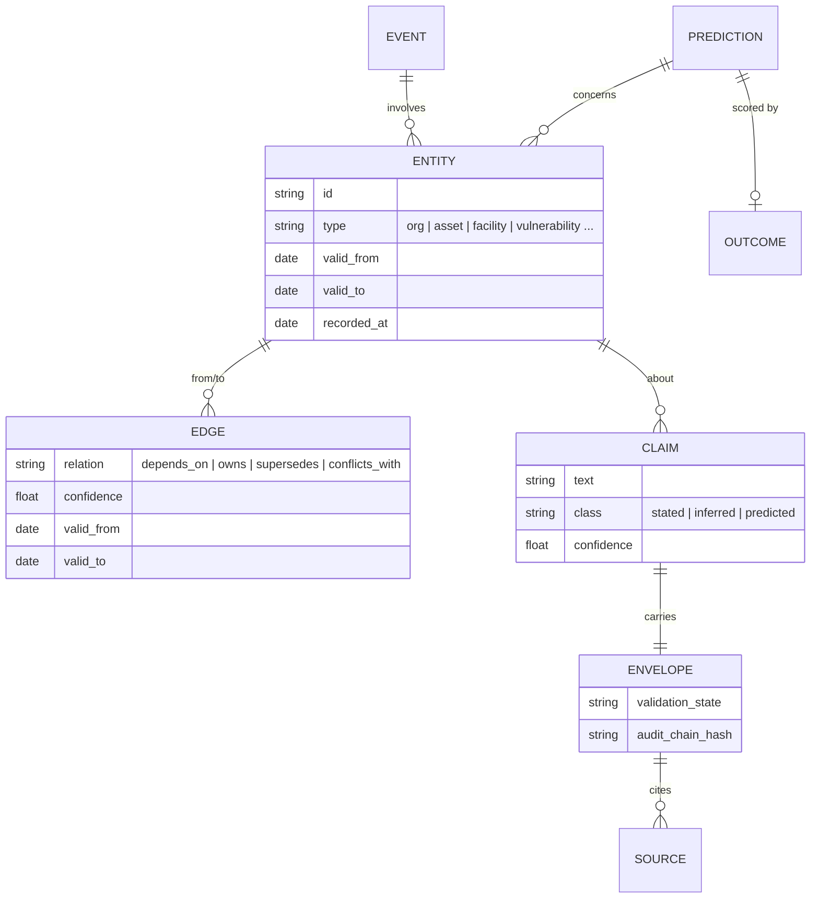

### 4.7 Predictive intelligence layer ◻

| Capability | Method | Output | Guardrail |
|---|---|---|---|
| Forecasting | Time-series models on owned metrics | Distribution with intervals | Backtested before display |
| Threat prediction | Vulnerability intelligence × asset graph × control coverage | Exposure probability per asset | Organization and asset level only |
| Market intelligence | Public signals, filings, tenders | Opportunity and risk scores | Approved public sources |
| Risk prediction | Propagation over the knowledge graph | Ranked risks with the path shown | Every score explains its path |
| Behaviour modelling | Baselines of *systems, services and agents* | Anomaly scores | No profiling of private individuals (charter) |
| Trend emergence, weak signals | Novelty and burst detection on the event stream | Candidate signals, low confidence by default | Surfaced as hypotheses, never as findings |

**Every prediction is written to a calibration ledger and scored when its
outcome resolves.** Agents' trust scores are computed from that ledger, so
autonomy is earned by track record, not granted by configuration (§11).

### 4.8 Digital twin infrastructure ◻

- **Organization, process and infrastructure twins** are projections of the
  knowledge graph plus live telemetry. **Security posture twins** add controls
  and exposure.
- **User twins are opt-in, self-owned preference profiles**: what a person
  asked Sentinel to remember about how they work, visible and deletable by
  them. They are never inferred profiles of people (charter).
- **Simulation before action:** every CHANGE or DEPLOY proposal runs against
  the relevant twin first. The simulation outputs a predicted blast radius,
  affected entities, reversibility and expected metric deltas. The kernel
  attaches it to the approval request, and the observed outcome is later
  compared with the prediction (calibration). This generalizes PHOENIX's
  "contain before you fix".

### 4.9 Autonomous decision framework ◐

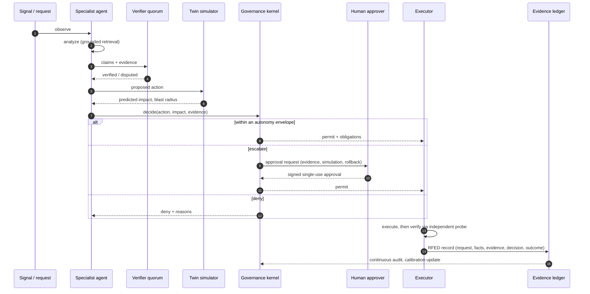

### 4.10 AI governance layer

Specified in §6.

### 4.11 Self-evolution engine ◐

- **Gap detection:** questions Sentinel could not answer (the console's
  "Ignored" terms), failed tasks, eval regressions, escalations that humans
  always approve (candidates for a new envelope).
- **Generation:** candidate skills, prompts, tool definitions or workflow
  changes, produced as pull requests. Builds on
  `tools/artemis_self_improvement_engine.py` and `agent_os/learning.py`.
- **Evaluation:** offline eval suite, then shadow mode, then canary. Each
  PR carries its eval deltas.
- **Approval:** a human approves every production change. Changes to the
  kernel, the charter or the eval suite itself are *never* proposed by the
  engine.
- **Rollback:** every deployed change has a one-step revert, rehearsed in
  the twin.

### 4.12 Advanced security architecture

Specified in §5.

### 4.13 Quantum-ready layer ◻

- **Crypto agility first.** Every signature, hash and ciphertext record
  carries an algorithm identifier, and verification dispatches on it. Today's
  HMAC-SHA-256 and X25519 records remain verifiable after migration.
- **Post-quantum migration path:**
  1. Inventory every key and signature (ledgers, approvals, age sidecar, TLS).
  2. Hybrid TLS key exchange: X25519 + ML-KEM-768 (FIPS 203).
  3. Ledger anchors and approvals signed with ML-DSA (FIPS 204).
  4. Long-lived roots on SLH-DSA (FIPS 205).
  5. Re-anchor historical ledgers under PQC signatures to defeat
     "harvest now, decrypt later" on evidence that must outlive 2035.
- **Quantum optimization** is a pluggable solver behind the twin's
  optimization interface (QUBO formulations for scheduling or routing). It is
  used only where a benchmark shows it beating classical solvers on the same
  instance. No quantum advantage is assumed.

### 4.14 Human-AI collaboration suite ◐

| Feature | Starting point | Evolution |
|---|---|---|
| Natural-language command centre | Console Ask, slash commands, Mission Control ✅ | Same surface; free questions go to the model through `/sentinel/ask` ✅, then to agents under the kernel |
| Spatial dashboards | Intelligence Graph ✅ | WebGPU 3D graph and twin views with the same accessible 2D and tree fallbacks |
| Role copilots | Smart actions ✅ | Copilots per role (CISO, counsel, operations) bound to that role's capabilities |
| Executive briefing engine | Executive brief action ✅, `agent_os/executive.py` | Scheduled briefs with provenance envelopes and counterfactuals |
| Scenario explorer | `/simulate` dry runs ✅ | Interactive twin simulations with side-by-side outcomes |
| Reasoning viewer | `/why N` ledger replay ✅ | Full RFED replay: facts seen, verifiers' votes, simulation, approver |
| Decision transparency | Four writing modes, stated assumptions ✅ | Every surface shows class (`stated` / `inferred` / `predicted`) and a link to its record |

---

## 5. Security model

### 5.1 Principles

1. Zero trust between every component, agents included.
2. Agents are untrusted code with credentials, and are treated as insiders
   (UEBA applies to them).
3. Model outputs and tool outputs are data, never instructions.
4. Secrets never enter prompts, logs or the browser.
5. Every artifact that runs is signed; every piece of evidence is chained.

### 5.2 Controls

| Domain | Control | Status |
|---|---|---|
| Identity | Workload identity (SPIFFE/SPIRE) per agent instance; short-lived certificates; mTLS mesh | ◻ |
| Authorization | Every call decided by the PDP; capability tiers; signed single-use approvals | ✅→◐ |
| Behaviour analytics | Per-agent baselines (tools used, data touched, tokens, egress); anomaly freezes the agent's capabilities pending review | ◻ |
| Threat intelligence | STIX/TAXII feeds into the knowledge graph, correlated with the asset graph | ◻ |
| Adversarial AI | Layered: input classifier (replaces the regex `redteam.py`), spotlighting of untrusted content, tool-output quarantine, egress allow-lists, canary tokens, output policy filter | ◐ |
| Model integrity | Signed model and prompt manifests; hash-pinned; eval fingerprint recorded in every RFED record | ◻ |
| Supply chain | SLSA level 3 builds, Sigstore signatures, SBOMs, pinned dependencies (the pinned GitHub Actions already follow this) | ◐ (blocked on Actions) |
| Cryptographic verification | Merkle-anchored ledgers; periodic external anchoring; crypto agility (§4.13) | ◐ |
| Privacy-preserving AI | PII redaction before model calls; keyed hashing of inputs (as `/sentinel/ask` does ✅); differential privacy on aggregates; confidential computing for sensitive tenants; federated learning at the edge | ◐ |
| Data | Tenant hard partitions (`vectorstore.py` ✅), Postgres RBAC recheck ✅, encryption at rest with per-tenant keys | ✅→◐ |

### 5.3 Agent-specific threat model

| Threat | Example | Mitigation |
|---|---|---|
| Indirect prompt injection | A fetched page tells the research agent to email a file | Tool outputs enter a data-only channel; egress allow-list; any send action is escalate-only |
| Privilege escalation by delegation | An agent spawns a child with broader access | Capability attenuation (§4.3) |
| Approval replay or repurpose | Reusing a "publish" approval to move money | Bound, single-use, expiring HMAC approvals ✅; ML-DSA later |
| Ledger tampering | Editing a past decision | Hash chain ✅ + Merkle anchor + external anchoring |
| Data poisoning | Planting false claims in sources | Corroboration requirement, source trust decay, contradiction escalation |
| Model supply compromise | A swapped model or prompt | Signed manifests and eval fingerprints |
| Cost exhaustion | Flooding the model endpoint | Per-IP throttle ✅, daily cap ✅, per-agent budgets |
| Surveillance misuse | Asking Sentinel to track a person | Charter gate ✅; person types unrepresentable in the graph ✅ |

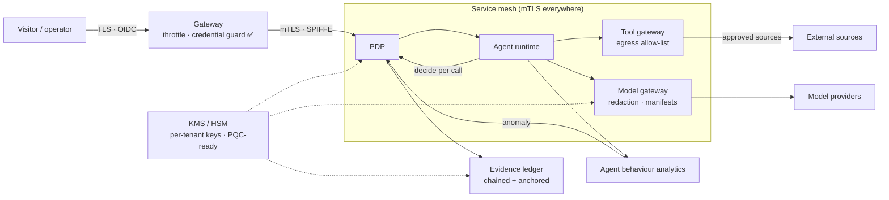

---

## 6. Governance model

### 6.1 Unified tiers

The four existing vocabularies (capability tiers, risk tiers, v2030 approval
tiers, autonomy tiers) collapse into one table, generated from the single
policy source:

| Capability tier | Risk tier | v2030 tier | Autonomy | Examples | Gate |
|---|---|---|---|---|---|
| READ_ONLY | low | allowed without approval | act-autonomous | read, analyze, summarize, simulate | log |
| DRAFT | low–medium | allowed without approval | recommend | draft copy, propose plan, open PR | log + review queue |
| CHANGE | medium–high | requires approval token | act-with-approval (or envelope) | restart service, publish content | signed approval or envelope |
| DEPLOY | high–critical | requires approval token | act-with-approval | pricing, payments, outbound, production deploy | signed approval, two approvers for critical |
| — | — | never permitted | — | delete evidence, disable monitoring, edit governance | unrepresentable |

### 6.2 Components

- **Policy engine:** Cedar or OPA bundle compiled from `policy/actions.yaml`,
  evaluated in-process where latency matters and centrally elsewhere.
  Deny overrides allow; unknown actions score 85 and escalate, as today.
- **Autonomy envelopes:** standing approvals with scope, rate, budget and
  expiry, for example "PHOENIX may restart `api` at most three times a day
  until 2026-12-31". They are signed like single-use approvals and revocable
  instantly. This fixes approval fatigue without widening what is possible.
- **Explainability:** every decision is an RFED record, and the reasoning
  viewer renders it. Explanations cite evidence, not chain-of-thought.
- **Audit trail:** the five ledgers keep their formats. Each publishes a daily
  Merkle root into one anchor chain, which is externally anchored, so a single
  proof covers everything.
- **Compliance monitoring:** controls are mapped once to ISO/IEC 42001, the
  NIST AI RMF, the EU AI Act risk tiers, and Canadian privacy law (PIPEDA;
  Ontario's PHIPA for health data, which the site already addresses).
  Evidence is collected continuously from the ledger.
- **Bias detection:** disaggregated evaluation of any output that affects
  people (for example lead qualification), with thresholds that block release.
- **Human override:** kill switches per agent, capability, tenant and
  globally ("stop the world"). Engaging one is always permitted, is audited,
  and cannot be overridden by an agent.
- **Decision provenance:** request, facts, evidence (model, prompt manifest,
  eval fingerprint), decision (score, tier, route, approver) and outcome, all
  in one record.

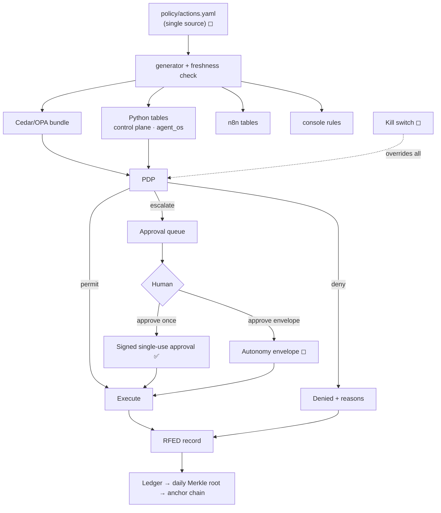

---

## 7. Agent ecosystem

### 7.1 Roster, mapped to swarm roles

| Role | Agents (existing → evolved) | Autonomy ceiling |
|---|---|---|
| Manager | `agent_os` orchestrator and executive, `agent_army` router → mission managers per goal | recommend; spawns within its own capabilities |
| Specialist | PERCIVAL (web estate), PHOENIX (recovery), PFAS (compliance), AEGIS (legal process), Purple-team, Agent Mesh OSINT agents, commerce operator | act-with-approval or envelope |
| Verifier ◻ | Claim verifier, change verifier (diff + twin), policy verifier | read-only; votes only |
| Governance | Policy governor ✅, RFED auditor ✅, calibration keeper ◻ | read-only; can freeze |
| Security | Adversarial-input classifier (from `redteam.py`), agent UEBA ◻, supply-chain watcher ◻ | read-only; can freeze and alert |
| Research | Collector ✅ + intelligence ✅ → research engine (§4.4) | read-only |
| Interface | Sentinel Core console ✅, `/sentinel/ask` ✅, role copilots ◻ | read-only for visitors |

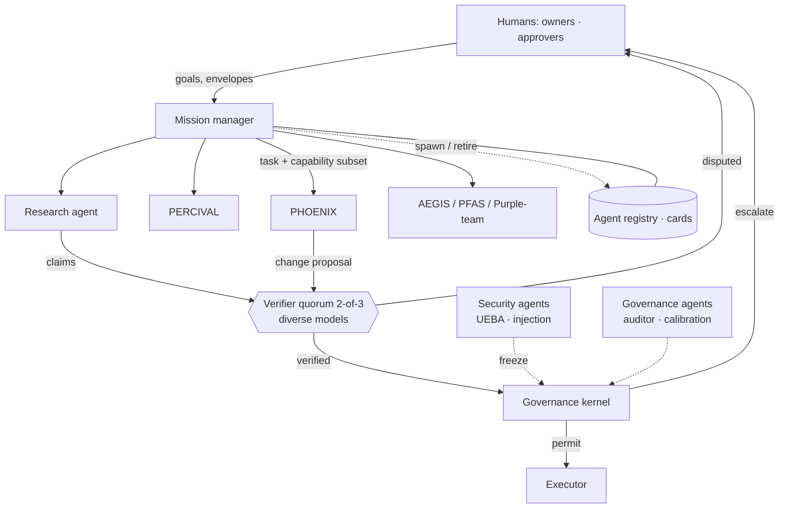

### 7.2 Lifecycle

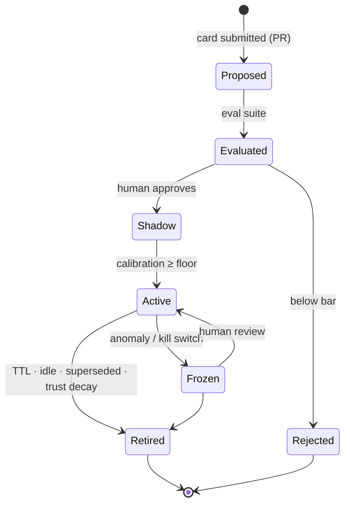

### 7.3 Consensus protocol

1. The producer submits **claim + evidence envelopes**, without its reasoning.
2. The router selects *n* verifiers across at least two model families.
3. Each verifier returns `supported | unsupported | insufficient`, with
   citations.
4. With *k* agreeing, the claim is accepted. Any `unsupported` with
   evidence, or no quorum, escalates with all positions attached.
5. Votes are written to the calibration ledger. Verifiers' own trust is
   scored against resolved outcomes.

---

## 8. Technology stack

Reference choices. Each is the conservative option that fits the current
repository; the right-hand column says why.

### 8.1 AI layer

| Need | Recommendation | Why here |
|---|---|---|
| Frontier reasoning, planning, verification | Claude family via the Anthropic API (Opus-class for planning and verification) | Already integrated (`sentinel_ai.py`), with refusal fallbacks and prompt caching |
| High-volume classification and routing | Small, fast models (for example Claude Haiku 4.5) | Cheap first pass; frontier only when needed |
| Edge and offline | Quantized open small language models | Sovereign and disconnected mode (§11) |
| Domain models | Fine-tuned or adapter models for PFAS, legal process and threat taxonomies, *only* where evals beat prompting | Avoids premature training cost |
| Multi-LLM orchestration | Model router keyed on task type, cost, latency and eval scores | Verifier diversity needs two or more model families |
| RAG | Hybrid lexical + vector + graph retrieval, re-ranking, citations per chunk; SABER rule on every retrieval | Extends `retrieval.py`'s trust loop |
| Agent framework | Claude API tool use (the pattern in `sentinel_ai.py`) inside a durable workflow engine; MCP for tool servers | Keeps the loop in ClearGlass's code, where the kernel can see it |
| Evals | Offline suites + online canaries, scored per route; regression gates in CI | Required for §4.11 |

### 8.2 Data layer

| Need | Recommendation | Why here |
|---|---|---|
| System of record | PostgreSQL (existing) | Already runs the ledger and commerce |
| Vector search | pgvector first; Pinecone/Milvus adapters (existing) at scale | No new database until load demands it |
| Graph | Apache AGE on Postgres first; Neo4j when traversal load demands | Same operational footprint |
| Event streaming | Kafka or Redpanda in core regions; NATS JetStream at the edge | Durable, replayable signals |
| Object storage | S3-compatible, per-tenant buckets and keys | Documents, imagery, evidence packs |
| Analytics | ClickHouse (fleet) and DuckDB (per-analyst) | Fast aggregates over the ledger and events |

### 8.3 Infrastructure layer

| Need | Recommendation | Why here |
|---|---|---|
| Orchestration | Managed Kubernetes, one region first | Matches the v9 blueprint without committing to it early |
| Service mesh | Istio (ambient) or Linkerd with SPIFFE identities | mTLS and identity without per-service code |
| Workflows | Temporal-class durable engine | Human signals, timers and compensation are native |
| Policy | Cedar or OPA sidecars | Local decisions, central bundles |
| Observability | OpenTelemetry → metrics, traces and logs backends | Traces through model and tool calls |
| Edge | k3s + NATS + small models on site hardware | Critical infrastructure and disconnected sites |
| GPUs | Cloud GPU pools for inference and fine-tuning; no owned clusters until utilization justifies them | Cost discipline for a small company |
| Resilience | Multi-region active-passive, then active-active; multi-cloud only for regulated tenants | Complexity is a risk (§10) |
| Data residency | Canadian regions first; per-tenant pinning | Ontario customers, PHIPA |

---

## 9. Implementation roadmap

Phases are gated by exit criteria, not dates. The dates are the expected
pace for a small team.

| Phase | Window | Scope | Exit criteria |
|---|---|---|---|
| **0 · Unblock and unify** | now → +6 weeks | Restore the GitHub Actions entitlement (org setting); until then, `scripts/ci_local.py` as a required pre-push hook and branch protection on `main`; fix the 21 red tests and 45 lint errors on `main`; deploy the control plane with `/sentinel/ask` enabled under a daily cap; single policy source generating the seven tables; daily Merkle roots from all five ledgers; OpenTelemetry on the control plane | CI green on `main`; one policy file; `test_governance.py` passes against generated tables; first anchor published |
| **1 · Runtime** | +1 → +3 months | Workflow engine; agent cards and registry; PHOENIX and PERCIVAL running as scheduled workers under the kernel; pgvector retrieval; eval harness v1 for Sentinel answers | Agents run without CI; every action carries an RFED record; answer evals gate prompt changes |
| **2 · Memory and knowledge** | +3 → +9 months | Memory tiers; bitemporal graph on Postgres (AGE), seeded from the site index and `graph.py`; research engine with envelopes; verifier quorum; autonomy envelopes | "What did we believe on date X" answerable; claims presented as fact have a quorum; approval clicks per week down, not the scope of autonomy up |
| **3 · Twins and prediction** | +9 → +18 months | Organization, infrastructure and security-posture twins; simulate-before-execute mandatory for CHANGE and above; forecasting, weak signals; document, image and GIS ingest; agent UEBA | No CHANGE action executes without a simulation; calibration ledger live; predicted vs observed blast radius tracked |
| **4 · Scale and sovereignty** | +18 → +36 months | Multi-tenant, multi-region, Canadian residency; edge nodes; confidential computing; hybrid PQC TLS and ML-DSA anchors; SLSA L3 | A tenant can run fully in Canada; an edge node survives 72 h disconnected; all evidence PQC-signed |
| **5 · Governed swarm autonomy** | 3 → 5 years | Self-evolution through eval-gated PRs; cross-organization federated intelligence with privacy guarantees; spatial command centre | Improvements ship with measured deltas; zero ungoverned actions in audit |
| **6 · Vision 2035** | 5 → 10 years | §13 | — |

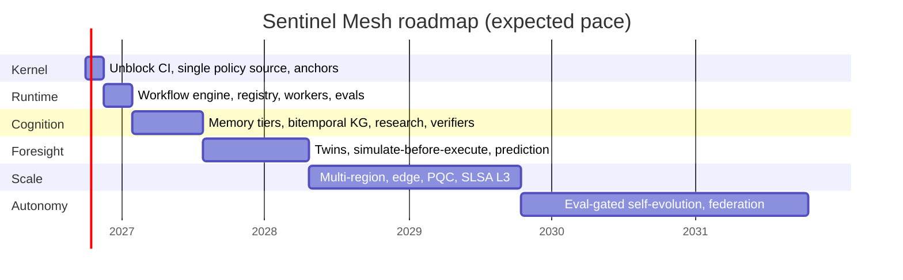

---

## 10. Risk analysis

| Risk | Likelihood | Impact | Mitigation |
|---|---|---|---|
| **Autonomy outruns governance** | Medium | Critical | Kernel-first ordering; envelopes, not per-agent grants; kill switch |
| **Over-engineering for company size**: planetary architecture before product-market fit | High | High | Every phase stands alone; Postgres-first data layer; no owned GPUs; no multi-cloud until a tenant requires it |
| CI remains blocked | Medium (today) | High | Phase 0 item 1; until then, `scripts/ci_local.py` before every push |
| Indirect prompt injection through gathered content | High | High | Data-only channel, egress allow-lists, send actions escalate-only |
| Hallucinated intelligence presented as fact | Medium | High | Stated/inferred/predicted classes; verifier quorum; citations required |
| Approval fatigue | High | Medium | Envelopes; batching; risk-tiered queues |
| Model vendor dependency | Medium | Medium | Model router; fallbacks; evals portable across providers |
| Cost runaway | Medium | Medium | Per-agent budgets; daily caps (exists for `/sentinel/ask`); small-model first pass |
| Surveillance misuse or regulatory breach | Low (charter) | Critical | Charter as schema; policy gate before any feed; external audits |
| Data poisoning | Medium | High | Corroboration, source trust decay, contradiction escalation |
| Evidence loses validity to quantum attacks | Low (now) | High (long-lived evidence) | Crypto agility; PQC re-anchoring |
| Key-person dependency | High | High | Everything as code and docs; deterministic replays; runbooks |

---

## 11. Competitive advantage and innovation

### 11.1 Positioning

| Category | Typical strength | Typical gap | Sentinel's position |
|---|---|---|---|
| Data-integration and ontology platforms | Operational data fusion at enterprise scale | Governance of *autonomous* action is add-on; costly | Governed autonomy as the core, Postgres-first cost |
| General AI assistants and copilots | Broad capability, polished UX | Evidence of what was done, and why, is thin | Every answer and action has a decision record |
| Agent frameworks | Fast to build agents | Leave governance to the builder | The kernel is the framework's centre |
| SIEM / SOAR | Mature detection and playbooks | Brittle automation, little reasoning | Reasoning agents inside the same fail-closed gates |

### 11.2 Innovations and why each creates advantage

| # | Innovation | Novelty | Strategic advantage |
|---|---|---|---|
| 1 | **Proof of Decision**: an exportable RFED record per decision, chained and anchored | Governance evidence as a product feature | Regulated buyers (health, government, critical infrastructure) can adopt autonomy because they can prove control |
| 2 | **Earned autonomy**: trust scores computed from a calibration ledger of scored predictions and outcomes | Replaces configured trust with measured trust | Autonomy grows safely and defensibly, agent by agent |
| 3 | **Autonomy envelopes**: signed, budgeted standing approvals | Humans govern limits, not clicks | Scales human oversight without approval fatigue |
| 4 | **Capability attenuation on spawn** | Object-capability security applied to swarms | Swarms cannot self-escalate, which removes a class of agent incidents |
| 5 | **Diverse-model verifier quorum** | Consensus across model families, blind to producer reasoning | Resilient to single-model failure and to correlated hallucination |
| 6 | **Simulation-gated execution** with predicted vs observed blast radius | Twins as a mandatory gate, calibrated over time | Fewer and smaller incidents; quantified operational risk |
| 7 | **Charter-as-schema**: person-targeting unrepresentable | Privacy by construction, not by filter | OSINT capability that is safe to sell and to audit |
| 8 | **Honest-UI contract**: readouts tested so they cannot claim what the system cannot see | Trust as an enforced UX property | Differentiates against dashboards that simulate certainty |
| 9 | **Counterfactual briefings**: "what would have to be true to change this recommendation" | Decision-grade explanation | Executives see decision sensitivity, not just a verdict |
| 10 | **Sovereign edge mode**: disconnected nodes with the same policy bundle and ledger, syncing on reconnect | Governance that works offline | Critical infrastructure and remote sites |
| 11 | **PQC-anchored evidence** | Long-lived audit that survives cryptographic transition | Evidence value holds for decades |
| 12 | **Self-evolution only as eval-gated PRs** | Improvement with its own audit trail | Continuous improvement that auditors can accept |

### 11.3 Emerging (5–10 years), experimental but feasible

- **Long-horizon goal agents** that keep months-long objectives with
  checkpoints, bounded by envelopes and reviewed at milestones.
- **World models as twins**: learned dynamics layered on the rule-based twin,
  always compared against the rules before use.
- **Metacognitive routing**: agents that know when they do not know, using
  calibration history to decide when to ask a human.
- **Federated threat intelligence** across organizations, with secure
  aggregation, so no participant reveals its raw telemetry.
- **Spatial, voice-first command centres**, with the same evidence links as
  the 2D console.

**AGI-adjacent concepts, with guardrails.** An open-ended skill library,
self-directed research within approved sources, cross-domain transfer through
the knowledge graph, and planning over years. The design treats capability
growth as a reason for *more* verification, not less: autonomy is always
bounded by envelopes a human signed.

---

## 12. Diagram index

| # | Diagram | Section |
|---|---|---|
| 1 | Executive architecture overview | [Executive overview](#executive-overview) |
| 2 | High-level system | [§3.2](#32-high-level-system) |
| 3 | Components | [§3.3](#33-components) |
| 4 | Agent ecosystem | [§7.1](#71-roster-mapped-to-swarm-roles) |
| 5 | Data flow | [below](#data-flow) |
| 6 | Security architecture | [§5.3](#53-agent-specific-threat-model) |
| 7 | Knowledge graph | [§4.6](#46-advanced-knowledge-graph-) |
| 8 | Governance | [§6.2](#62-components) |
| 9 | Deployment | [below](#deployment) |
| 10 | Roadmap | [§9](#9-implementation-roadmap) |
| + | Decision loop (sequence), agent lifecycle (state) | [§4.9](#49-autonomous-decision-framework-), [§7.2](#72-lifecycle) |

### Data flow

```mermaid
flowchart LR
    subgraph In["Sources (approved only)"]
        WEB["Public web · feeds"]
        DOC["Documents"]
        SEN["Sensors · IoT"]
        GIS["GIS · licensed imagery"]
        OPS["Owned telemetry"]
    end
    In --> GATE["Charter gate ✅<br/>before any record is touched"]
    GATE --> STR["Event stream"]
    STR --> NORM["Normalize → claims + envelopes"]
    NORM --> VAL["Validate · corroborate · score"]
    VAL --> KG[("Bitemporal KG")]
    VAL --> VEC[("Vector index")]
    KG --> RET["Retrieval (SABER rule)"]
    VEC --> RET
    RET --> AG["Agents"]
    AG --> TW["Twin simulation"]
    TW --> PDP["Kernel decision"]
    PDP --> OUT["Answer · brief · action"]
    OUT --> LED[("Evidence ledger")]
    OUT -->|outcomes| CAL[("Calibration ledger")]
    CAL -->|trust scores| AG
```

### Deployment

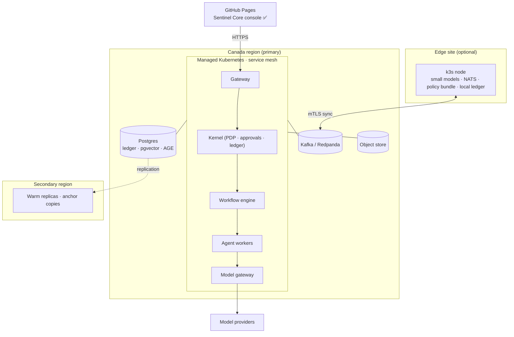

---

## 13. Sentinel AI Vision 2035

**Sentinel in 2035 is a governed intelligence utility.** Organizations run
their operations with it, and regulators accept its evidence.

### A morning in 2035

At 06:10 a water utility's edge node, disconnected during a storm, detects a
pressure anomaly across three pump stations. The node's small model
classifies it, and its local twin simulates two responses. Isolation of one
station falls inside the utility's autonomy envelope, so it executes, then
verifies through an independent probe. The node writes the RFED record to its
local ledger.

When the link returns, the ledger syncs and its Merkle root joins the anchor
chain. The regional mission manager assembles the picture. A research agent
correlates the anomaly with a public advisory on the pump firmware. A verifier
quorum confirms the advisory applies, two of three across two model families.
The knowledge graph propagates the exposure to 41 other sites.

At 07:00 the operations director asks, by voice, "What happened overnight and
what do you need from me?" The briefing lists:

- what the system *knows* (stated), what it *believes* (inferred) and what it
  *expects* (predicted, with calibration history);
- the one action it took and its evidence;
- one decision it needs: patch 41 sites, simulated, with the predicted
  service impact per site and a rollback plan.

The director approves an envelope: patch in maintenance windows, at most five
sites an hour, halt on any failed probe. Everything after is inside that
envelope and on the record.

### What is true of Sentinel in 2035

| Property | Target |
|---|---|
| Every executed action carries a decision record | 100%, verifiable by any auditor |
| Actions outside a human-signed envelope or approval | 0 |
| Claims presented as fact with verifier quorum and citations | 100% |
| Consequential actions simulated before execution | 100% (CHANGE tier and above) |
| Prediction calibration published per agent | Continuous, from the calibration ledger |
| Evidence verifiable after the post-quantum transition | Yes: PQC anchors, crypto-agile records |
| Private individuals identified, tracked or profiled | Never; unrepresentable by schema |
| Operates disconnected | Edge nodes with the same policy and ledger |

**The line from here to there is the one in §9.** Unify the kernel first,
because every capability after it inherits its guarantees.
